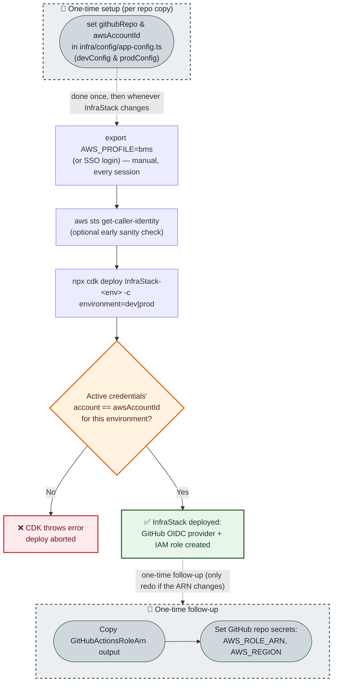
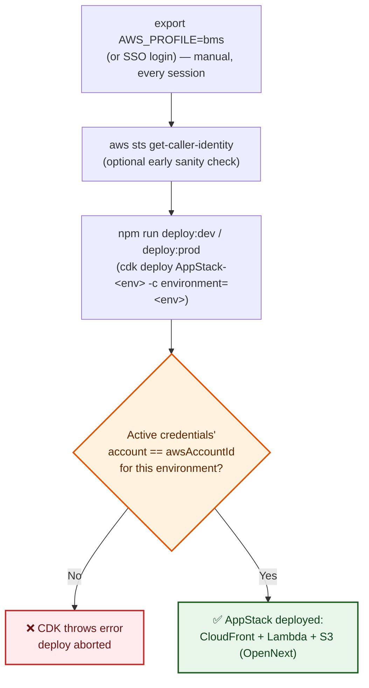
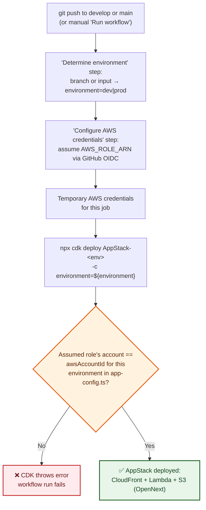

# Deployment Flows

How this project gets onto AWS.

| Path | When |
|---|---|
| **Manual** | From a developer machine (`cdk deploy`) |
| **CI** | GitHub Actions on push (or Run workflow) |

Step-by-step: [`getting-started.md`](./getting-started.md).

**Account-pinning (both paths)**

- `infra/bin/app.ts` sets each stack `env.account` from `awsAccountId` in `infra/config/app-config.ts`.
- CDK **refuses** to deploy if active credentials (local profile **or** assumed CI role) are a different account.

## Manual (local)

`InfraStack` and `AppStack` are **independent** (no cross-stack refs). Two CLI commands, either order.

| Stack | Redeploy when |
|---|---|
| `InfraStack` | OIDC / IAM (or other long-lived infra) changes — rare today |
| `AppStack` | Every app ship |

Do **not** read the diagrams as “AppStack waits on InfraStack.”

### InfraStack (GitHub OIDC + IAM role)

| Styled as one-time | Why |
|---|---|
| Config edit (`Setup`) | Once per repo copy |
| Secret wiring (`Followup`) | Redo only if the role ARN changes |
| **Not** the deploy (`C`–`H`) | Today InfraStack is mostly OIDC, but it is the home for longer-lived infra (DB, cache, …). Calling the deploy “one-time” would go stale when that grows. |

### AppStack (the Next.js app)

Prerequisite: `awsAccountId` already set in `app-config.ts` (shared config, not created by this stack).

- Nothing auto-selects the AWS account. `export AWS_PROFILE=...` every session, for **each** stack.
- Pinning only **fails loud** on a wrong profile (no silent wrong-account deploy).
- Two CLI invocations → a mix-up can pass for one stack and fail the other.

## CI (GitHub Actions)

| Trigger | Environment |
|---|---|
| Push `develop` | `dev` |
| Push `main` | `prod` |
| Run workflow | `dev` or `prod` (input) |

- One `AWS_ROLE_ARN` / `AWS_REGION` secret pair is shared by both envs.
- Fine while `dev` and `prod` share `awsAccountId`.
- Split accounts later → node `F` fails for the unmatched env. Then add `AWS_ROLE_ARN_DEV` / `AWS_ROLE_ARN_PROD` and pick by environment (not implemented yet).

## See also

- [`getting-started.md`](./getting-started.md) — setup steps
- [`../infra/docs/deployment.md`](../infra/docs/deployment.md) — OpenNext architecture, env vars, domain, troubleshooting
