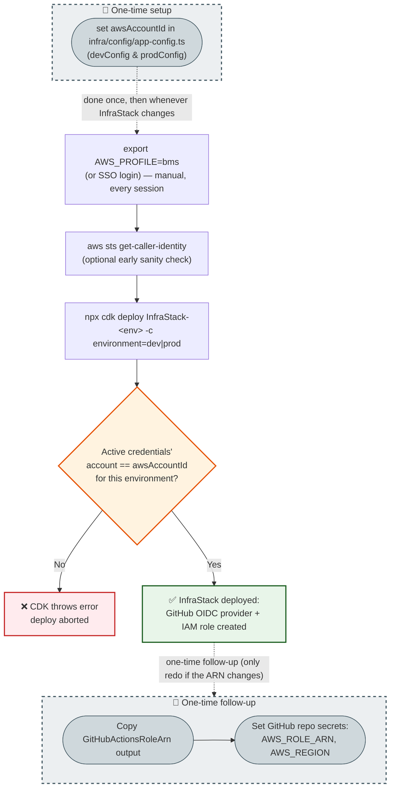
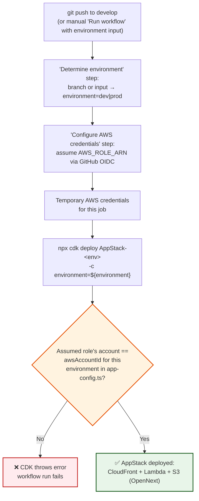

# Deployment Flows

Visual reference for the two ways this project gets deployed: manually from a developer
machine, and automatically via GitHub Actions. See [getting-started.md](./getting-started.md)
for the step-by-step instructions these diagrams summarize.

Both flows go through the same account-pinning guard: `infra/bin/app.ts` pins each stack's
`env.account` to `awsAccountId` in `infra/config/app-config.ts`, and CDK refuses to deploy if
the active AWS credentials resolve to a different account — regardless of whether those
credentials came from a local AWS profile or an assumed IAM role in CI.

## Manual (local) deployment

`InfraStack` and `AppStack` are independent CDK stacks with no cross-stack references — they're
deployed by two separate CLI commands, at different times, in no particular required order.
`InfraStack` only needs redeploying when the OIDC/IAM setup changes (rare); `AppStack` is what
you redeploy every time you ship app changes. Shown as two separate diagrams below rather than
one chain, since drawing them as a single linear flow would wrongly imply `AppStack` depends on
`InfraStack` succeeding first.

### Deploy InfraStack (GitHub OIDC provider + IAM role)

**Why the deploy itself (`C`–`H`) isn't styled as "one-time":** today `InfraStack` only contains
the GitHub OIDC provider + IAM role (see `infra/lib/stacks/infra-stack.ts`), so in practice this
whole stack currently *is* deployed once and rarely touched again. But that file already has a
placeholder comment for adding other infrastructure (databases, caching, etc.), and `InfraStack`
is meant to hold that kind of longer-lived, potentially-changing infrastructure going forward —
not just the OIDC setup. Framing the deploy step itself as "one-time" would describe today's
incidental state, not the stack's actual purpose, and would go stale the moment something else
gets added to it. Only the config edit (`Setup`) and the post-deploy secret wiring (`Followup`)
are styled that way.

### Deploy AppStack (the Next.js app)

Prerequisite: `awsAccountId` must already be set in `infra/config/app-config.ts` (see above) —
that's shared config, not something this stack sets up itself.

Key point (both diagrams): nothing here selects the right AWS account for you.
`export AWS_PROFILE=...` is a manual step every session, for each stack you deploy — the
account-pinning check only catches it if you get it wrong (hard error instead of a silent
wrong-account deploy). Because these are two separate CLI invocations, a profile mix-up could
pass the check for one stack and fail it for the other.

## CI (GitHub Actions)

Key point: `.github/workflows/deploy.yml` currently reads **one** `AWS_ROLE_ARN`/`AWS_REGION`
secret pair, shared by both `dev` and `prod` deploys. That's fine as long as `dev` and `prod`
resolve to the **same** `awsAccountId` in `app-config.ts`. If you later split them into separate
AWS accounts, this single secret pair can only satisfy one of them — the "assumed role's account
== awsAccountId" check (node `F`) will fail for whichever environment doesn't match. At that
point you'd need `AWS_ROLE_ARN_DEV`/`AWS_ROLE_ARN_PROD` (and matching region secrets), with the
"Configure AWS credentials" step picking between them based on the resolved environment — not
implemented yet, since account IDs for this repo aren't configured at all (see
[getting-started.md](./getting-started.md)).

Also note: the `main` branch auto-deploy trigger is currently commented out in
`.github/workflows/deploy.yml` — pushing to `main` today does not auto-deploy prod. The only way
to deploy prod via CI right now is the manual `workflow_dispatch` path with `environment: prod`.

## Reference

- [getting-started.md](./getting-started.md) — step-by-step setup instructions
- [infra/docs/deployment.md](../infra/docs/deployment.md) — OpenNext deployment guide
  (architecture, env vars, custom domain, troubleshooting)
