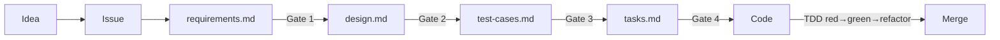

# Development Process — Spec-Driven + Test-Driven

Every non-trivial change is **specified and tested before it is built**.

- AI drafts each artifact.
- A human **approves at each gate**. AI does not skip ahead.

| Source of truth | Lives in |
|---|---|
| Spec + test cases | **Repo**, next to the code |
| Execution (epic / sub-issues) | **GitHub Issues** |
| Portfolio / roadmap | **Notion** only — not work items |

## Spec set (4 files)

| File | Phase | Purpose |
|---|---|---|
| `requirements.md` | 1 | WHAT & WHY — user stories + EARS |
| `design.md` | 2 | HOW — architecture, data model, decisions |
| `test-cases.md` | 3 | PROOF — Given/When/Then mapped to each criterion |
| `tasks.md` | 4 | PLAN — ordered checklist → Req & TC ids |

## Roles

| Actor | Does |
|---|---|
| **Human** | Approves gates, product/architecture calls, reviews PRs |
| **AI (Claude Code)** | Drafts spec set, implements test-first, opens PRs, self-verifies |

## Phases

| Phase | Artifact | Gate | Contents |
|---|---|---|---|
| **0 Intake** | GitHub Issue | — | The ask. Feature Request or Bug. No solution yet. |
| **1 Requirements** | `requirements.md` | **Gate 1** | Glossary; user stories (`As a … I want … so that …`); EARS (`WHEN … THE system SHALL …`) |
| **2 Design** | `design.md` | **Gate 2** | Architecture, components, data model/contracts, sequence diagrams, decisions + rejected alternatives, Req ids |
| **3 Test cases** | `test-cases.md` | **Gate 3** | Given/When/Then; cites `Req 1.1`; happy/edge/error; every criterion has ≥1 test |
| **4 Tasks** | `tasks.md` | **Gate 4** | One-PR-sized steps; cites `(Req 1.2 · TC-2)`; large ones → GitHub sub-issues |
| **5 Implement** | code + tests | — | TDD loop (below) |
| **6 Verify** | PR merge | — | Review, merge, issue closes, tick `tasks.md`. Update specs if reality changed. |

**TDD loop (Phase 5)**

1. **Red** — write the test(s) from `test-cases.md`; they fail.
2. **Green** — minimum code to pass.
3. **Refactor** — keep tests green.

- One task → one branch → one PR ([`git-flow.md`](./git-flow.md)).
- PR links the spec and `Closes #<issue>`.
- Tests live with the code (Jest units, Playwright E2E).

## Where files live

Always named `requirements.md`, `design.md`, `test-cases.md`, `tasks.md`.

| Scope | Path |
|---|---|
| One feature | `<domain>/src/features/<feature>/docs/` e.g. `frontend/src/features/engineers/docs/` |
| Cross-cutting | `docs/specs/<initiative>/` |

- Templates: [`specs/_template/`](./specs/_template/)
- Fastest: `/new-feature <name>` in Claude Code

## GitHub mapping

| Artifact | GitHub | Label |
|---|---|---|
| Feature / initiative | Spec issue (epic) — links spec set, gate checkboxes | `spec` |
| Substantial `tasks.md` item | Task sub-issue — cites Req & TC ids | `task` |
| Small task | Checkbox in `tasks.md` only | — |
| Defect | Bug issue | `bug` |

**Phase labels:** `phase:requirements` · `phase:design` · `phase:test-cases` · `phase:tasks` · `phase:implementation`

**Branch / PR**

- Branch: `feature/<issue#>-<short-slug>` (or `fix/<issue#>-…`)
- PR body: link spec + `Closes #<issue>` (closing a sub-issue updates the epic)

## Authority

| For… | Owner |
|---|---|
| Requirements, design, tests, task breakdown | **Repo spec set** |
| Execution & code review | **GitHub Issues / PRs** |
| Portfolio & roadmap | **Notion** (project level) |

## Start a spec

1. `/new-feature <name>` — scaffolds from `docs/specs/_template/`, opens the Spec epic, starts Phase 1.
2. Or copy `docs/specs/_template/` and open **📋 Spec / Epic**.

## See also

- Quick start: [`new-feature-workflow.md`](./new-feature-workflow.md)
- Layout: [`structure.md`](./structure.md)
- Branching: [`git-flow.md`](./git-flow.md)
- AI-coding record: [`ai-coding-transformation.md`](./ai-coding-transformation.md)
