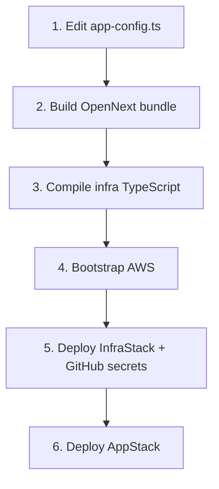

# Getting Started

Get a fresh clone deployable on AWS.



## 1. Project identity — one file

Edit **`infra/config/app-config.ts`**. That is the only in-repo file needed to point this template at your AWS accounts and GitHub repo.

```typescript
export const githubRepo = 'my-org/my-repo';
export const resourcePrefix = 'myapp';

export const devConfig: AppConfig = {
  awsAccountId: '111111111111',
  alarmEmail: 'me@example.com',
};

export const prodConfig: AppConfig = {
  awsAccountId: '222222222222', // same ID as dev if you share one account
};
```

| Field | Required | What it does |
|---|---|---|
| `awsAccountId` (dev **and** prod) | **Yes** — CDK throws if still `REPLACE_...` | Pins `env.account` in `infra/bin/app.ts`. No silent fallback to whatever credentials are active. Same ID in both configs if they share an account. |
| `githubRepo` | Yes for CI | `owner/repo`. Scopes OIDC trust (`github-oidc-role.ts`). A differently named repo cannot assume the role. |
| `resourcePrefix` | **Yes if multiple projects share one AWS account** | Prefixes account-scoped names: stacks `<prefix>-infra\|app\|monitoring-<env>` and IAM role `<prefix>-github-oidc-deploy-role`. Same prefix → second deploy **updates the first**. Not covered (also unique per account): GitHub OIDC provider, CFN exports (this template declares none). |
| `alarmEmail` | No | CloudWatch alarm email. If set, deploys `MonitoringStack-<env>` with `AppStack-<env>`. |
| `domainNames`, `certificateArn`, `awsRegion`, `environmentVariables`, `serverMemoryMb`, `imageMemoryMb` | No | See comments on `AppConfig`. |

Steps 2–6 are **outside** the repo (AWS credentials, GitHub settings).

## 2. Build the OpenNext frontend bundle

`AppStack` reads `frontend/.open-next` directly. CDK does **not** run `open-next build` for you.

- Every CDK command loads `app.js` and synthesizes **all** stacks.
- Even `bootstrap` / `InfraStack` fails with `ENOENT` if `.open-next` is missing.

```bash
cd frontend
npm install
npm run build:open-next                # → frontend/.open-next
```

- Re-run whenever frontend code changed and you are about to run CDK.
- `npm run deploy:dev` / `deploy:prod` compile **infra** TypeScript only — they do **not** rebuild the frontend.
- Skipping this is the most common cause of a stale or missing deploy.

## 3. Compile the infra TypeScript

`cdk.json` runs `node dist/bin/app.js`. `dist/` must exist before `bootstrap` / `deploy` / `synth` / `diff`.

```bash
cd infra
npm install
npm run build                          # tsc → infra/dist/
```

## 4. Bootstrap AWS

`-c environment=dev|prod` is **mandatory**. No default. CDK must load `app.js` to know which account to target.

Account pinning from step 1 **does not pick credentials** — it only **rejects** the wrong account.

**bash / Git Bash / macOS / Linux**

```bash
export AWS_PROFILE=bms   # or SSO — credentials for the target account
aws sts get-caller-identity
```

**PowerShell (Windows)** — quotes required (`$env:AWS_PROFILE = bms` fails):

```powershell
$env:AWS_PROFILE = "opennext-serverless-user"
aws sts get-caller-identity
```

Profile lasts **this terminal session only**.

```bash
cd infra
npx cdk bootstrap -c environment=dev   # first time only, per account/region
```

- Active credentials' account must match `awsAccountId` for that env, or CDK aborts.
- Separate prod account → also `npx cdk bootstrap -c environment=prod` with prod credentials.

## 5. Deploy `InfraStack` + GitHub secrets

**Required before the first push to `develop`.**

`.github/workflows/deploy.yml` runs on **every** `develop` push. If the OIDC role is missing, the run fails with “could not assume role” (red X on a push you did not intend to deploy).

### i. Deploy `InfraStack`

Creates the GitHub OIDC provider + IAM role (uses step 4 credentials).

```bash
cd infra
npx cdk deploy InfraStack-dev -c environment=dev
```

- Trusts `githubRepo` from step 1.
- Copy `GitHubActionsRoleArn`.
- Separate prod account → also `InfraStack-prod`.

### ii. GitHub secrets

**Settings → Secrets and variables → Actions**

| Secret | Value |
|---|---|
| `AWS_ROLE_ARN` | `GitHubActionsRoleArn` output |
| `AWS_REGION` | e.g. `ap-northeast-1` |

The workflow uses **one** `AWS_ROLE_ARN` / `AWS_REGION` pair for both `dev` and `prod`. Fine while they share `awsAccountId`. Split accounts later → `AWS_ROLE_ARN_DEV` / `AWS_ROLE_ARN_PROD` (and matching regions), and teach the workflow to pick by environment.

**No CI at all?** Comment out `push: branches` (and `workflow_dispatch` if unused) in `.github/workflows/deploy.yml`. Do not skip this step otherwise.

## 6. Deploy the app stack

Steps 2, 3, and 5 done. Manual and CI are both always available.

**Manual** (re-run step 2 if frontend changed):

```bash
cd infra
npm run deploy:dev     # AppStack-dev + MonitoringStack-dev
npm run deploy:prod    # AppStack-prod + MonitoringStack-prod
```

`MonitoringStack-<env>` deploys only if `alarmEmail` is set.

**CI**

| Branch / action | Environment |
|---|---|
| Push `develop` | **dev** (auto) |
| Push `main` | **prod** (auto) |
| Actions → Run workflow | `dev` or `prod` (manual) |

```bash
git checkout develop
git push origin develop
```

Workflow builds OpenNext, assumes the OIDC role, deploys `AppStack-<env>` / `MonitoringStack-<env>`.

## See also

| Doc | For |
|---|---|
| [`deployment-flows.md`](./deployment-flows.md) | Diagrams + account-pinning guard |
| [`../infra/CLAUDE.md`](../infra/CLAUDE.md) | CDK command cheat sheet |
| [`../infra/docs/deployment.md`](../infra/docs/deployment.md) | Full OpenNext deploy guide |
