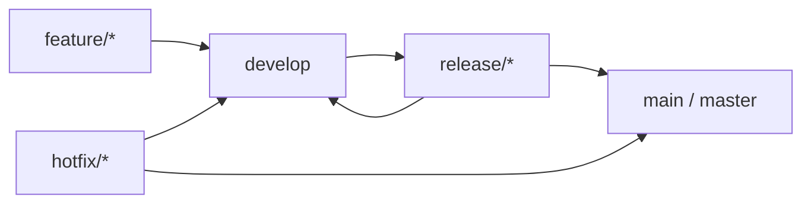

# Git branch strategy

This project uses **GitFlow**.

| Branch | Role | Environment |
|---|---|---|
| `feature/*` | Work in progress | none |
| `develop` | Integration | **dev** (CI auto-deploy) |
| `release/*` | Freeze / release prep | none |
| `main` | Production-ready (CI uses this name) | **prod** (CI auto-deploy) |
| `hotfix/*` | Prod emergency fix | none (merge to `main` then deploy) |

The diagram in the image may say `master`. **GitHub / CI use `main`.** Treat them as the same production branch.

**Flow**

1. Cut `feature/*` from `develop` → merge back to `develop`.
2. Cut `release/*` from `develop` → stabilize.
3. Merge `release/*` into `main` **and** `develop` → prod deploys from `main`.
4. Prod bug → `hotfix/*` from `main` → merge to `main` and `develop`.
