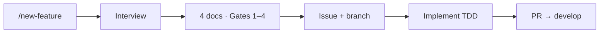

# Creating a New Feature — workflow

Quick start. Full rules: [`development-process.md`](./development-process.md).



## Steps

1. **Run the command** (Claude Code):
   ```
   /new-feature <feature-name> [frontend|backend|infra|cross-cutting]
   ```

2. **Answer the interview** until every answer is concrete. No vague factors. Confirm any default.

3. **Approve 4 docs, one gate at a time.**

   | Doc | Gate | Notes |
   |---|---|---|
   | `requirements.md` | 1 | User stories + EARS |
   | `design.md` | 2 | Includes a **File & Folder Plan** per [`../frontend/docs/conventions.md`](../frontend/docs/conventions.md) |
   | `test-cases.md` | 3 | Follows the domain `test-plan.md` |
   | `tasks.md` | 4 | Checklist citing `Req · TC` ids |

   Written to the feature `docs/` folder, e.g. `frontend/src/features/<slug>/docs/`.

4. **Issue + branch (after Gate 4)**
   - Create the GitHub issue
   - Branch off `develop`: `feature/#<issue>_<slug>` (e.g. `feature/#4_new-feature-commands`)

5. **Implement test-first** — `tasks.md` with red → green → refactor. Follow the domain `test-plan.md`. Tests live with the code.

6. **Land it** — commit, push, PR into `develop`. Commits / pushes / PRs happen **only when you ask**.

## Gates

Claude never skips ahead. Each gate is your control point so spec and code stay aligned with intent.

## See also

| Topic | Doc |
|---|---|
| Full process | [`development-process.md`](./development-process.md) |
| Branching | [`git-flow.md`](./git-flow.md) |
| Naming / file placement | [`../frontend/docs/conventions.md`](../frontend/docs/conventions.md) |
| Testing per domain | `<domain>/docs/test-plan.md` |
| Command source | `.claude/commands/new-feature.md` |
