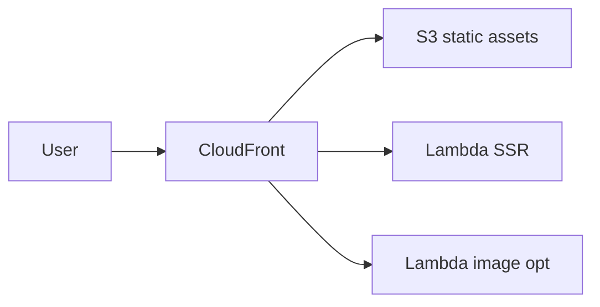

# Product Overview

**BMS** (Bar Management System) — a full-stack admin dashboard.

| Domain | What it is |
|---|---|
| **Frontend** | TailAdmin-based dashboard: data viz, users, forms, tables, charts, auth UI. Next.js 15 App Router + React Server Components |
| **Backend** | AWS Lambda functions |
| **Infra** | AWS CDK (infrastructure as code) |

## Hosting

**OpenNext** — CloudFront + Lambda + S3 (Next.js serverless adapter).

| Why OpenNext | Detail |
|---|---|
| Next.js coverage | SSR, ISR, Middleware, Image Optimization |
| Cost | Pay-per-request; typically &lt; $1 USD/month at low traffic |
| Delivery | Global CDN via CloudFront |
| Ops | Fully managed as CDK IaC |

> Originally targeted AWS AppRunner. Rationale for the move: [`../infra/docs/reference/migration-plan.md`](../infra/docs/reference/migration-plan.md)
