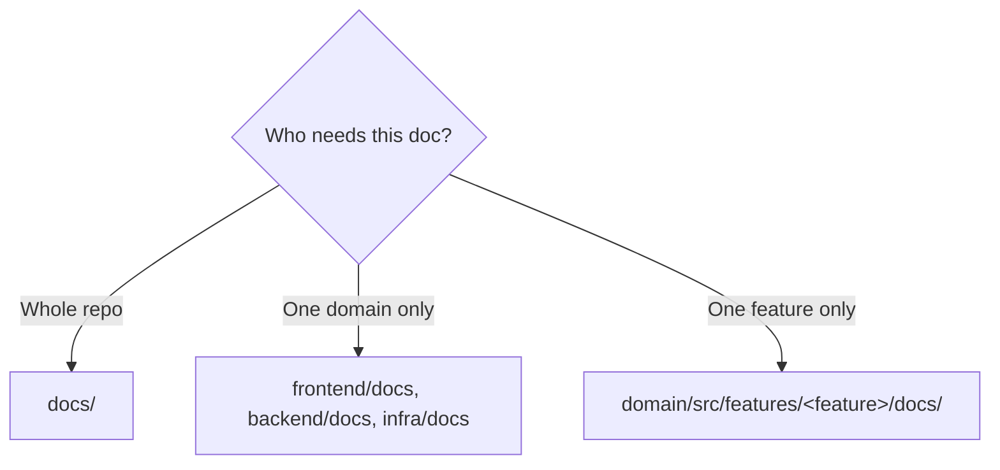

# Repository Structure (monorepo)

Three deployable domains + shared docs.

```
/
├── frontend/   # Next.js application (see frontend/docs/)
├── backend/    # AWS Lambda functions (see backend/docs/)
├── infra/      # AWS CDK → OpenNext (see infra/docs/)
└── docs/       # Project-wide documentation
```

## Documentation policy

Put a doc at the **narrowest scope that fully contains its subject**.

| Scope | Location | Examples |
|---|---|---|
| Project-wide | `docs/` | product, tech stack, this file, git flow |
| One domain | `<domain>/docs/` | `frontend/docs/conventions.md`, `infra/docs/deployment.md` |
| One feature | `<domain>/src/features/<feature>/docs/` | `frontend/src/features/engineers/docs/` |



- Each domain has a `CLAUDE.md` auto-loaded in that subtree; it `@import`s the relevant docs.
- Feature spec filenames are always: `requirements.md`, `design.md`, `test-cases.md`, `tasks.md`.

## Documentation map

```
CLAUDE.md                          # root entry → @imports project docs, points to domain CLAUDE.md
docs/                              # PROJECT-WIDE
├── product.md                     # what the product is
├── tech-stack.md                  # stack, hosting rationale, dev tools, install notes
├── structure.md                   # this file: repo layout + doc policy + this map
├── development-process.md         # Spec-Driven + Test-Driven workflow
├── new-feature-workflow.md        # quick start: /new-feature → gates → PR
├── getting-started.md             # first-deploy: config, bootstrap, InfraStack, CI secrets
├── deployment-flows.md            # mermaid: manual + CI deploys
├── git-flow.md                    # branching strategy
├── todo.md                        # project backlog
├── ai-coding-transformation.md    # AI-coding conversion record + next agenda
├── specs/                         # cross-cutting (multi-domain) specs
│   ├── _template/
│   └── <initiative>/{requirements,design,test-cases,tasks}.md
└── assets/                        # diagrams & images

frontend/
├── CLAUDE.md
├── docs/
│   ├── conventions.md
│   ├── structure.md
│   ├── test-plan.md
│   ├── nextjs/{app-router,server-actions}.md
│   ├── lib-setup/{biome,jest,pino,prisma}.md
│   └── ui-template/tailadmin-readme.md
└── src/features/<feature>/docs/
    └── requirements.md  design.md  test-cases.md  tasks.md

infra/
├── CLAUDE.md
└── docs/
    ├── deployment.md
    ├── troubleshooting.md
    ├── test-plan.md
    ├── migration-plan.md
    ├── aws-infrastructure-diagram.md
    ├── reference/migration-plan.md
    ├── assets/aws_diagram.drawio
    └── _archive-apprunner/        # obsolete — do not follow

backend/
├── CLAUDE.md
└── docs/
    └── test-plan.md
```

## Domain details

| Domain | See |
|---|---|
| Frontend | [`../frontend/docs/structure.md`](../frontend/docs/structure.md) |
| Infra | [`../infra/docs/deployment.md`](../infra/docs/deployment.md) |
| Frontend naming | [`../frontend/docs/conventions.md`](../frontend/docs/conventions.md) |
