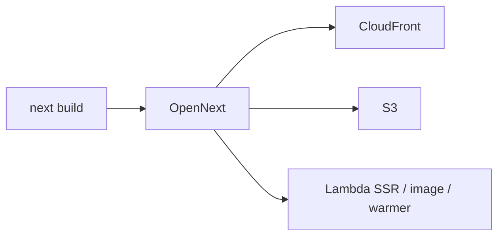

# Tech stack

| カテゴリ | 利用技術 | Status |
|---|---|---|
| フロントエンド | Next.js | インストール済 |
| ホスティング | OpenNext (CloudFront + Lambda + S3) | 実装中 |
| 認証 | Cognito | 未実装 |
| サーバーログ | Pino | インストール済 |
| 外部ログ出力先 | AWS CloudWatch, Sentry | 未実装 |
| エラー解析 | Sentry | 未実装 |
| ORM | Prisma | インストール済 |
| linter/formatter | Biome | インストール済 |
| 単体テスト | Jest | インストール済 |
| E2Eテスト | Playwright | 未実装 |
| in-memory Cache | AWS Redis | 未実装 |

## Hosting 選定

| 候補 | 良い点 | 制約 / 問題 | 結論 |
|---|---|---|---|
| **Amplify** | 完全サーバーレスでコスト最適 | SSR bundle 220MB 制限; ISR / On-Demand ISR 不可; cold start 1〜3秒; Next.js 実装がブラックボックス; CDK で一元管理できない | ❌ |
| **ECS Fargate** | 柔軟 | ALB + 常時起動でコスト高。このアプリには overkill | ❌ |
| **AppRunner** | Next.js フル機能; CDK 一元管理; Always-warm; bundle 制限なし; 最小 ~$3–5/月 | **2026-04-30 で新規提供終了**（既存は継続、新機能なし） | ❌ 廃止方向のため移行 |
| **OpenNext** (CloudFront + Lambda + S3) | Next.js 専用アダプター; SSR / ISR / Middleware / Image Optimization; CDK 一元管理; リクエスト課金; CloudFront CDN; Dockerfile 不要; ISR は S3、revalidation は SQS+Lambda | コールドスタート ~200–500ms（管理画面なら許容） | ✅ 採用 |

> OpenNext は当初 `cdk-nextjs-standalone` 想定だったが、現行スタックは手書き construct（`infra/lib/constructs/open-next-site.ts`）を使う。

## Development tools

| Tool | Role |
|---|---|
| Biome | Linter / formatter |
| Jest | Unit tests |
| Playwright | E2E (planned) |
| npm | Package manager |
| Prisma | ORM |

## Install notes

- Peer-dependency errors → `npm install --legacy-peer-deps`
- Node.js **18.x+** required (**20.x+** recommended)
- Windows: clone near the drive root (path-length limits)

> Per-domain commands: `frontend/CLAUDE.md`, `infra/CLAUDE.md`
