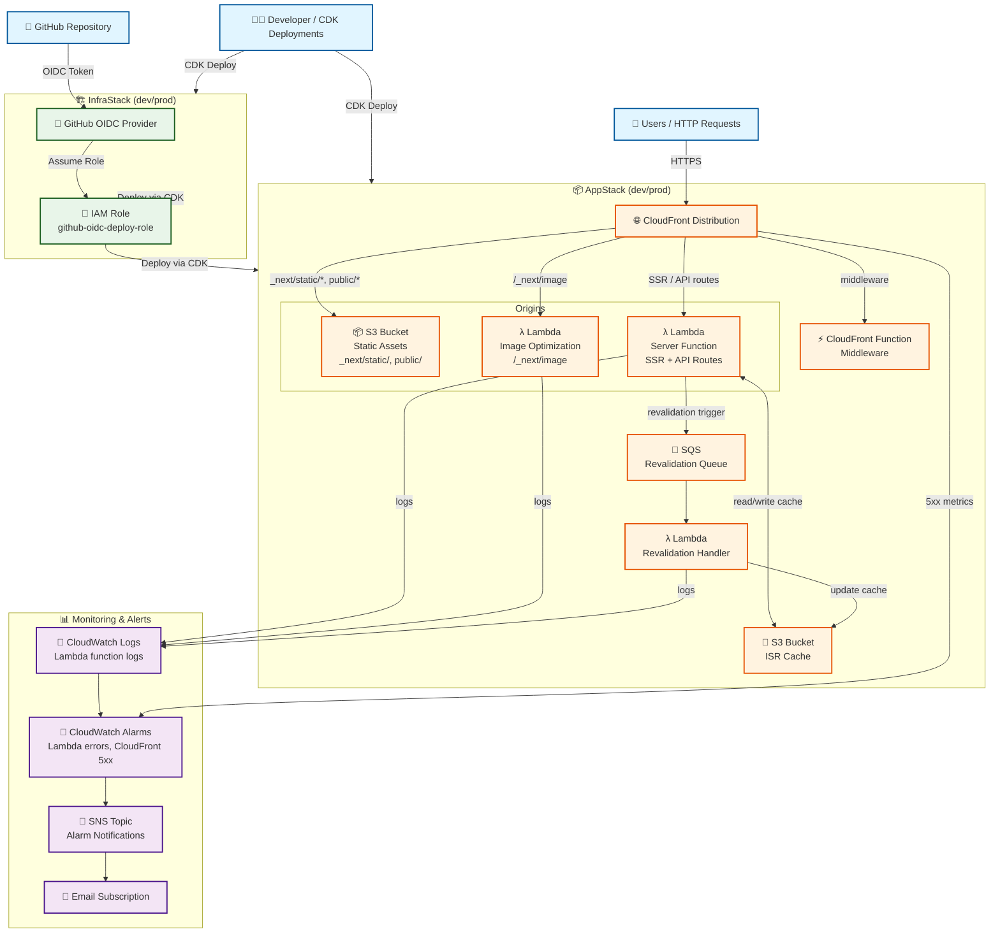

# AWS Infrastructure I/O Diagram

This document provides a visual representation of the AWS infrastructure components and their relationships in this project.

## Architecture Overview



## Component Details

### AppStack Components

| Component | Type | Role |
|---|---|---|
| CloudFront Distribution | CDN | Routes requests to correct origin, serves cached responses |
| S3 (assets) | Storage | Static files (`_next/static/`, `public/`) |
| S3 (cache) | Storage | ISR page cache |
| Lambda (server) | Compute | SSR rendering + API routes |
| Lambda (image) | Compute | `next/image` optimization |
| Lambda (revalidation) | Compute | Handles ISR on-demand revalidation |
| CloudFront Function | Edge compute | Next.js middleware (routing, auth headers) |
| SQS | Queue | Revalidation job queue (decouples trigger from handler) |

### CloudFront Routing Rules

| Path pattern | Origin |
|---|---|
| `_next/static/*` | S3 (assets) |
| `public/*` | S3 (assets) |
| `/_next/image*` | Lambda (image) |
| All other paths | Lambda (server) |

### Monitoring Components

| Component | What it watches |
|---|---|
| CloudWatch Logs | Lambda invocation logs (server, image, revalidation) |
| CloudWatch Alarms | Lambda error rate, CloudFront 5xx rate |
| SNS Topic | Alarm fanout |
| Email Subscription | `yuichiroyamaji@hotmail.com` |

### InfraStack Components

| Component | Role |
|---|---|
| GitHub OIDC Provider | Federates GitHub Actions identity to AWS |
| IAM Role (github-oidc-deploy-role) | Assumed by GitHub Actions for CDK deployments |

## Data Flow

### Application Request Flow

```
Users → CloudFront
  ├── static assets    → S3 (assets)
  ├── image requests   → Lambda (image optimization)
  ├── SSR / API        → Lambda (server function)
  └── middleware       → CloudFront Function
```

### ISR Revalidation Flow

```
Lambda (server) → SQS → Lambda (revalidation) → S3 (cache)
                                                     ↑
Lambda (server) ─────────────────── read cache ──────┘
```

### CI/CD Deployment Flow

```
Developer / GitHub Actions → CDK → CloudFormation
  → S3 (assets): upload built static files
  → Lambda: deploy server/image/revalidation function code
  → CloudFront: update distribution (invalidate cache if needed)
```

## Environment Separation

| | Development (`dev`) | Production (`prod`) |
|---|---|---|
| Stack names | `AppStack-dev`, `InfraStack-dev` | `AppStack-prod`, `InfraStack-prod` |
| Lambda memory | 512 MB | 1024 MB |
| CloudFront cache TTL | Short (easier debugging) | Standard |

## Cost Estimate

| Resource | Cost |
|---|---|
| Lambda (server) | ~$0.20 per 1M requests + duration |
| Lambda (image) | ~$0.20 per 1M requests + duration |
| S3 (assets + cache) | ~$0.023 per GB/month |
| CloudFront | First 1 TB/month free, then $0.0085/GB |
| SQS | First 1M requests/month free |
| **Total (low traffic)** | **< $1 USD/month** |

Compared to AppRunner (~$3–5/month always-on), cost is significantly lower for admin dashboards with variable/low traffic.

## Security

- IAM roles follow least privilege (Lambda execution roles scoped to S3 buckets they own)
- OIDC for GitHub Actions (no long-lived credentials)
- CloudFront enforces HTTPS
- S3 buckets are not publicly accessible (CloudFront Origin Access Control)

## Outputs

1. **CloudFront URL**: `https://xxxxxxxxxx.cloudfront.net` (or custom domain)
2. **Alarm Topic ARN**: SNS topic for monitoring alerts
3. **GitHub Actions Role ARN**: IAM role for CI/CD deployments
